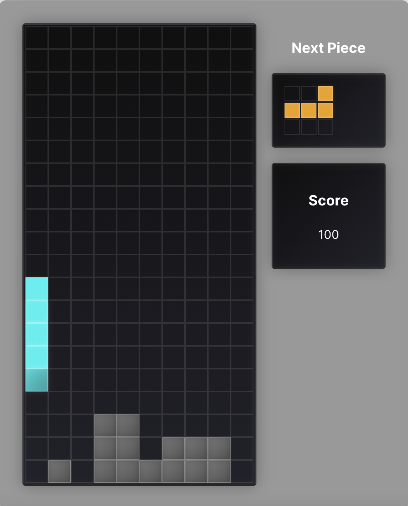

# Tetris

A modern Tetris implementation built with React, TypeScript, and Vite.




## Tech Stack

- React 19
- TypeScript 5.7
- Vite 6.1
- SWC (via @vitejs/plugin-react-swc)

## Development

### Prerequisites

- Node.js (version that matches your package.json engine requirements)
- npm or yarn

### Getting Started

1. Clone the repository
```bash
git clone git@github.com:realpeterz/tetris.git
cd tetris
```

2. Install dependencies
```bash
npm install
```

3. Start the development server
```bash
npm run dev
```

### Available Scripts

- `npm run dev` - Start development server with hot reload
- `npm run build` - Build for production
- `npm run preview` - Preview production build locally
- `npm run lint` - Run ESLint

## ESLint Configuration

The project uses a modern ESLint setup with TypeScript support. To enable stricter type-aware linting rules, update the configuration:

1. Configure parser options in `eslint.config.js`:
```js
export default tseslint.config({
  languageOptions: {
    parserOptions: {
      project: ['./tsconfig.node.json', './tsconfig.app.json'],
      tsconfigRootDir: import.meta.dirname,
    },
  },
})
```

2. Enable type-checked configs:
- Replace `tseslint.configs.recommended` with either:
  - `tseslint.configs.recommendedTypeChecked` or
  - `tseslint.configs.strictTypeChecked`
- Optionally add `...tseslint.configs.stylisticTypeChecked`

## License

MIT
